# 💳 StayEase Payment Service


---

# 📖 Overview

The **StayEase Payment Service** is the financial transaction domain of the StayEase microservices platform, responsible for managing the complete payment lifecycle for hostel and PG bookings.

The service handles payment order creation, payment confirmation, payment verification, payment retries, refund processing, receipt generation, audit logging, scheduled payment expiration, and secure webhook processing through Razorpay.

Built using **Spring Boot**, **Spring Data JPA**, **Spring Security**, **OpenFeign**, and **Netflix Eureka**, the service follows enterprise-grade microservice architecture principles with **Database per Service**, **Service Discovery**, **Gateway Pattern**, **Resilience4j Fault Tolerance**, **Spring Boot Actuator**, and **Micrometer Monitoring**.

Inter-service communication is performed through dedicated Service Gateway classes, providing retry mechanisms, circuit breakers, bulkheads, and fallback handling for resilient communication with Booking Service and Razorpay APIs.

The service also implements structured audit logging, correlation ID propagation, scheduled background jobs, JWT-based authentication, environment-based configuration, and production-ready monitoring capabilities while maintaining complete ownership of financial transactions within the StayEase ecosystem.

---

# 🎯 Business Problem

Processing online payments requires far more than simply recording whether a payment succeeded or failed.

A modern booking platform must ensure that:

- Payment orders are securely generated.
- Every payment is uniquely identifiable.
- Payments are verified before confirming bookings.
- Failed payments can be retried safely.
- Refunds are processed reliably.
- Payment receipts are generated.
- Financial events are auditable.
- Pending payments expire automatically.
- External payment gateway events are processed securely.
- Payment information remains isolated from other business domains.

Without a dedicated Payment Service, financial logic would become tightly coupled with booking management, leading to duplicated business rules, poor maintainability, and increased security risks.

---

# 💡 Business Solution

The StayEase Payment Service centralizes all payment-related functionality into a dedicated microservice while integrating with Razorpay for secure payment processing.

The service is responsible for:

- Payment Order Creation
- Payment Confirmation
- Payment Verification
- Retry Failed Payments
- Refund Processing
- Receipt Generation
- Payment Status Tracking
- Payment History
- Audit Logging
- Scheduled Payment Expiration
- Razorpay Webhook Processing
- Booking Payment Coordination

By isolating all payment-related operations into a dedicated service, StayEase maintains clear financial ownership while supporting scalable and secure transaction processing.

---

# ⚠ Development Note

The Payment Service integrates with the official Razorpay Java SDK for payment order creation and verification.

During backend development, a dedicated test confirmation endpoint is available to simulate successful payment completion because the StayEase frontend payment interface has not yet been implemented.

Once the frontend is integrated, payment confirmation will occur through the standard Razorpay Checkout flow, and the development endpoint can be removed without affecting the overall payment architecture.

---

# 🏢 Enterprise Concepts Demonstrated

This project demonstrates several enterprise backend engineering concepts commonly adopted in production systems.

- Database per Service
- Domain-Driven Service Separation
- Layered Architecture
- Service Discovery (Netflix Eureka)
- Gateway Pattern for Inter-Service Communication
- OpenFeign Declarative REST Clients
- External Payment Gateway Integration (Razorpay)
- Resilience4j Retry
- Resilience4j Circuit Breaker
- Resilience4j Bulkhead
- Fallback Strategies
- Spring Boot Actuator
- Micrometer Metrics
- Prometheus Monitoring Ready
- Payment Lifecycle Management
- Secure Payment Verification
- Refund Management
- Receipt Generation
- Audit Logging
- Correlation ID Propagation
- JWT Header Propagation
- Scheduled Background Jobs
- Bean Validation
- Global Exception Handling
- Structured Logging
- Transaction Management

---

# 🎯 Project Objectives

The Payment Service has been designed with the following objectives:

- Centralize payment processing.
- Maintain ownership of financial transactions.
- Integrate securely with Razorpay.
- Coordinate booking payments.
- Support payment verification.
- Process refunds reliably.
- Generate payment receipts.
- Maintain complete payment audit history.
- Demonstrate enterprise-grade payment architecture.

---

# ✨ Features

## 💳 Payment Management

- Payment Order Creation
- Payment Confirmation
- Payment Verification
- Payment Status Tracking
- Payment History
- Retry Failed Payments
- Payment Expiration Scheduler

---

## 💰 Refund Management

- Complete Refund Lifecycle
- Refund Processing
- Refund Status Tracking
- Booking Refund Coordination

---

## 🧾 Receipt Management

- Receipt Generation
- Receipt Retrieval

---

## 🔐 Payment Security

- JWT Authentication
- Header Authentication Filter
- Razorpay Signature Verification
- Secure Payment Validation
- Correlation ID Propagation

---

## 🌐 External Integrations

- Razorpay REST APIs
- Booking Service Integration
- Service Gateway Pattern
- Netflix Eureka Service Discovery
- OpenFeign Communication

---

## 🛡 Reliability

- Retry
- Circuit Breaker
- Bulkhead
- Fallback Handling
- Global Exception Handling
- Bean Validation
- Transaction Management

---

## 📊 Monitoring

- Spring Boot Actuator
- Micrometer Metrics
- Prometheus Ready
- Health Endpoints
- Metrics Endpoints
- Structured Logging
- Audit Logging

---

## ⚙ Background Processing

- Scheduled Payment Expiry
- Audit Trail
- Payment Synchronization

---

# 🛠 Technology Stack

| Category | Technology |
|-----------|------------|
| Language | Java 21 |
| Framework | Spring Boot 3.2.5 |
| Build Tool | Gradle |
| Database | MySQL |
| ORM | Spring Data JPA |
| Security | Spring Security, JWT |
| Service Discovery | Netflix Eureka Client |
| Inter-Service Communication | Spring Cloud OpenFeign |
| External Payment Gateway | Razorpay REST APIs |
| Fault Tolerance | Resilience4j (Retry, Circuit Breaker, Bulkhead, Fallbacks) |
| Monitoring | Spring Boot Actuator |
| Validation | Jakarta Bean Validation |
| Scheduling | Spring Scheduler |
| Build Automation | Gradle |


---

# 🏛 High-Level Architecture

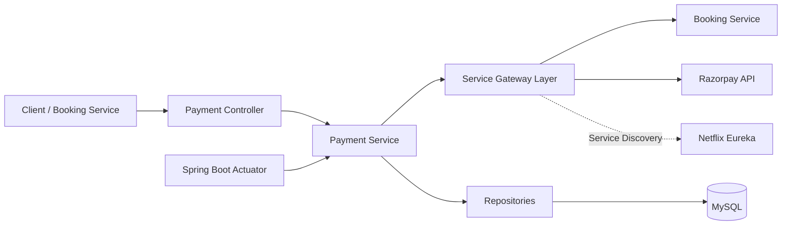
---

# 💳 Payment Service Responsibilities

The Payment Service acts as the financial transaction domain for the StayEase platform.

Its primary responsibilities include:

- Managing payment orders.
- Processing payment confirmations.
- Verifying payments.
- Coordinating booking payments.
- Processing refunds.
- Generating payment receipts.
- Maintaining audit logs.
- Handling payment webhooks.
- Expiring pending payments.
- Tracking payment history.

By isolating payment processing into a dedicated microservice, the StayEase platform maintains secure financial boundaries while enabling independent scalability and maintainability.

---

# 🌟 Why a Dedicated Payment Service?

Separating payment processing into its own microservice provides several enterprise advantages.

- Independent Financial Domain
- Secure Payment Processing
- External Payment Gateway Integration
- Centralized Refund Management
- Complete Audit Trail
- Reduced Service Coupling
- Independent Scalability
- Production-Ready Payment Architecture

---
# 📂 Project Structure

```text
stayease-payment-service
│
├── gradle/
│
├── src
│   ├── main
│   │
│   ├── java
│   │   └── com
│   │       └── stayease
│   │           └── payment_service
│   │
│   │               ├── config
│   │               │   ├── BookingServiceClient.java
│   │               │   ├── FeignClientConfig.java
│   │               │   ├── RazorpayClient.java
│   │               │   └── RazorpayFeignConfig.java
│   │               │
│   │               ├── controller
│   │               │   └── PaymentController.java
│   │               │
│   │               ├── dto
│   │               │   ├── Request
│   │               │   └── Response
│   │               │
│   │               ├── entity
│   │               │   ├── AuditLog.java
│   │               │   ├── PaymentOrder.java
│   │               │   ├── PaymentOrderStatus.java
│   │               │   ├── RefundStatus.java
│   │               │   └── RefundTransaction.java
│   │               │
│   │               ├── exception
│   │               │
│   │               ├── integrations
│   │               │   ├── BookingServiceGateway.java
│   │               │   └── RazorpayServiceGateway.java
│   │               │
│   │               ├── repository
│   │               │
│   │               ├── security
│   │               │   ├── HeaderAuthenticationFilter.java
│   │               │   └── SecurityConfig.java
│   │               │
│   │               ├── service
│   │               │   ├── AuditService.java
│   │               │   ├── PaymentExpiryScheduler.java
│   │               │   ├── PaymentService.java
│   │               │   ├── PaymentServiceImpl.java
│   │               │   ├── RazorpayOrderService.java
│   │               │   ├── RazorpayOrderServiceImpl.java
│   │               │   ├── RazorpayVerificationService.java
│   │               │   ├── RazorpayVerificationServiceImpl.java
│   │               │   ├── RefundService.java
│   │               │   └── RefundServiceImpl.java
│   │               │
│   │               └── PaymentServiceApplication.java
│   │
│   ├── resources
│   │   └── application.yaml
│   │
│   └── test
│       └── java
│
├── .gitignore
├── LICENSE
├── README.md
├── build.gradle
├── settings.gradle
├── gradlew
└── gradlew.bat
```

---

# 📦 Package Responsibilities

The Payment Service follows a modular package structure where each package has a clearly defined responsibility. This separation improves maintainability, testability, scalability, and aligns with enterprise software engineering principles.

| Package | Responsibility |
|----------|----------------|
| **config** | Contains infrastructure configuration including OpenFeign clients, Razorpay integration, Feign logging, error decoding, and communication with external services. |
| **controller** | Exposes REST endpoints for payment creation, payment confirmation, refund processing, payment status retrieval, payment history, and receipt-related operations. |
| **dto** | Defines request and response models exchanged between clients, Booking Service, and external payment gateway integrations while keeping domain entities isolated from API contracts. |
| **entity** | Represents the payment domain model including payment orders, payment lifecycle states, refund transactions, audit logs. |
| **exception** | Implements centralized exception handling for business rule violations, resource lookup failures, payment processing errors, and standardized API error responses. |
| **repository** | Performs persistence operations using Spring Data JPA for payment orders, refund transactions, and audit logs while abstracting database access from business logic. |
| **security** | Secures internal APIs using Spring Security and Header Authentication Filter to ensure only trusted users and microservices access payment operations. |
| **service** | Contains the complete payment business logic including payment order creation, payment confirmation, payment verification, refund management, audit logging, receipt generation, and Booking Service coordination. |
| **resources** | Stores externalized configuration such as application properties, Razorpay credentials, logging configuration, and environment-specific settings. |
| **test** | Contains unit and integration tests validating payment workflows, business rules, and service interactions. |

---

# 🏗 Layered Architecture

The Payment Service follows a layered architecture that separates API exposure, business logic, persistence, and external payment gateway integration into independent layers.

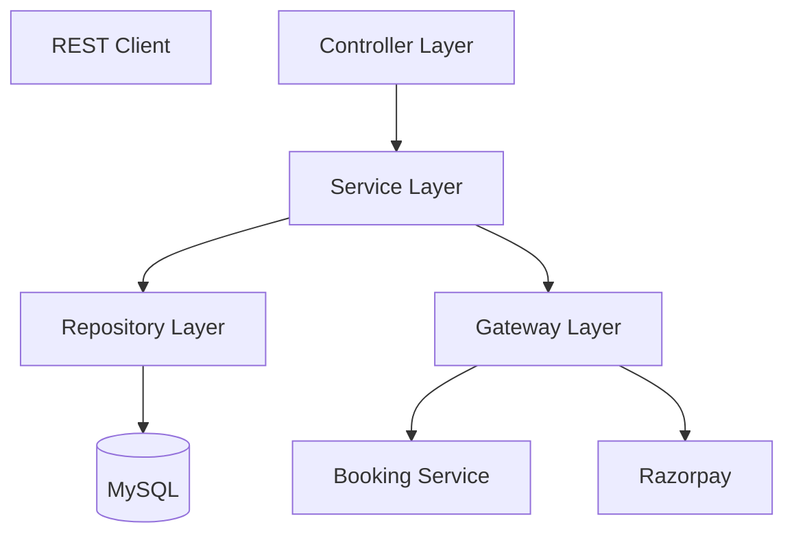

Each layer has a dedicated responsibility:

- **Controller Layer** receives and validates incoming REST requests.
- **Service Layer** executes payment business rules and orchestrates payment workflows.
- **Repository Layer** manages persistent financial records.
- **Booking Service Client** coordinates payment state with booking lifecycle.
- **Razorpay Integration** communicates securely with the external payment gateway.

This architecture promotes loose coupling, high cohesion, and independent evolution of each layer.

---

# 📚 Package Overview

## 📁 config

Contains infrastructure-level configuration for the Payment Service including OpenFeign clients, Razorpay client configuration, request interceptors, authentication propagation, Feign error handling, and communication with downstream services.

Responsibilities include:

- Booking Service Feign Client
- Razorpay API Client
- Feign Request Interceptors
- JWT Header Propagation
- Correlation ID Propagation
- Basic Authentication for Razorpay
- Feign Logging
- Error Decoder Configuration

---

## 📁 controller

Acts as the REST API entry point for all payment-related operations.

Responsibilities include:

- Payment Order APIs
- Payment Confirmation APIs
- Payment Status APIs
- Retry Payment APIs
- Refund APIs
- Receipt APIs
- Payment History APIs
- Razorpay Webhook Endpoint

---

## 📁 dto

Contains request and response models exchanged between clients, Booking Service, and Razorpay while keeping persistence entities isolated from API contracts.

Includes:

- Request DTOs
- Response DTOs
- Webhook Payload Models
- Payment Models
- Refund Models

---

## 📁 entity

Defines the financial domain model of the application.

Core entities include:

- PaymentOrder
- RefundTransaction
- AuditLog
- PaymentOrderStatus
- RefundStatus

---

## 📁 exception

Provides centralized exception handling and business-specific exceptions.

Responsibilities include:

- Business Exception Handling
- Resource Not Found Handling
- Global Exception Mapping
- Standardized API Error Responses

---

## 📁 integrations

Implements the Service Gateway pattern for all outbound service communication.

Responsibilities include:

- Booking Service Gateway
- Razorpay Service Gateway
- Retry Logic
- Circuit Breaker Integration
- Bulkhead Protection
- Fallback Handling
- Centralized External Service Communication

---

## 📁 repository

Provides database access using Spring Data JPA.

Responsibilities include:

- Payment Order Persistence
- Refund Transaction Persistence
- Audit Log Persistence
- Payment History Queries
- Refund Queries

---

## 📁 security

Secures REST APIs using Spring Security and Header Authentication.

Responsibilities include:

- JWT Authentication
- Header Authentication Filter
- Authorization Rules
- Internal Service Authentication
- Security Filter Chain

---

## 📁 service

Contains the complete business logic for payment processing.

Responsibilities include:

- Payment Order Management
- Payment Confirmation
- Payment Verification
- Retry Payment Processing
- Refund Processing
- Receipt Generation
- Audit Logging
- Payment Expiration Scheduler
- Razorpay Signature Verification
- Booking Synchronization
- Webhook Processing

---

## 📁 resources

Contains externalized application configuration.

Includes:

- Environment Profiles
- Database Configuration
- Eureka Configuration
- Feign Configuration
- Resilience4j Configuration
- Actuator Configuration
- Logging Configuration
- Razorpay Credentials
- Monitoring Configuration

---

## 📁 test

Contains unit and integration tests for validating payment workflows, business rules, gateway communication, and service interactions.

The service layer orchestrates all payment-related operations while coordinating with Razorpay and the Booking Service.

---
# 🔄 Payment Request Lifecycle

Every payment request follows a structured processing pipeline to ensure financial consistency, secure gateway communication, and reliable transaction management.

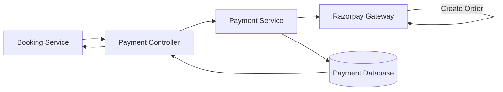
This lifecycle ensures every payment request is validated, persisted, and synchronized with the external payment gateway before user payment begins.

---

# 💳 Payment Lifecycle

A payment progresses through multiple business states during its lifecycle.

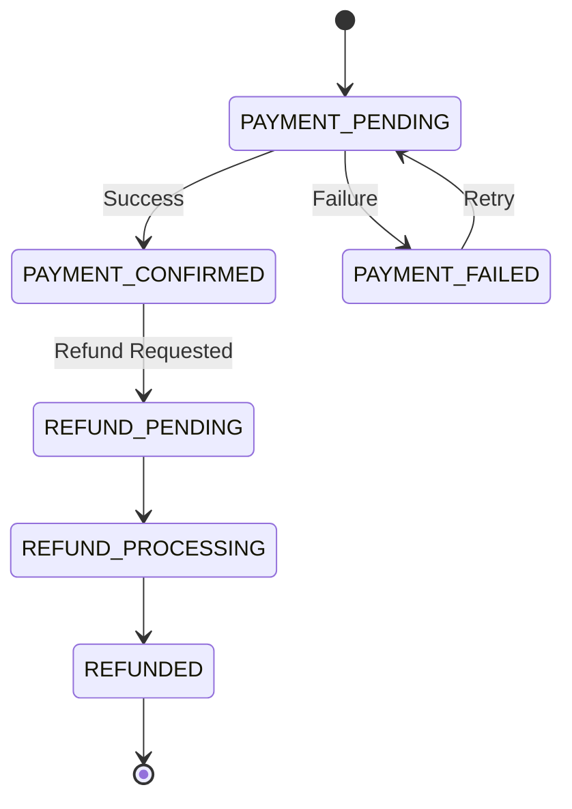

The Payment Service controls every transition to ensure payment consistency while coordinating with the Booking Service.

---

# 🏦 Payment Order Creation Workflow

When a customer books a property, the Booking Service requests the Payment Service to create a payment order.

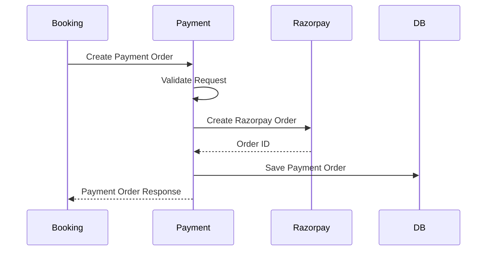

The Payment Service owns payment creation while Razorpay generates the external payment order identifier used during checkout.

---

# ✅ Payment Confirmation Workflow

After the customer completes payment, the payment confirmation process validates and finalizes the transaction.

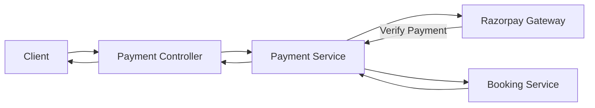

During backend development, payment confirmation can also be triggered using the dedicated testing endpoint. Once the frontend is integrated, this confirmation will be initiated through the Razorpay Checkout flow.

---

# 🔐 Razorpay Verification Workflow

Payment authenticity is verified before any booking is confirmed.

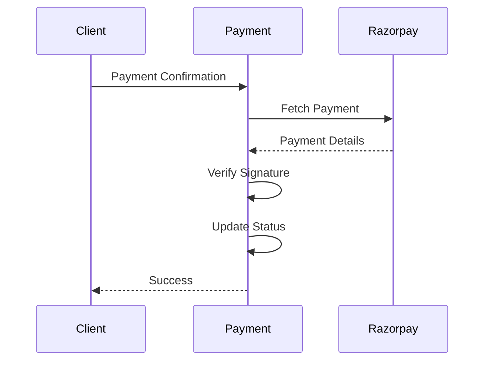

This verification process protects the application against forged or tampered payment confirmations.

---

# 💰 Refund Processing Workflow

Refunds are processed independently of payment creation while maintaining a complete financial history.

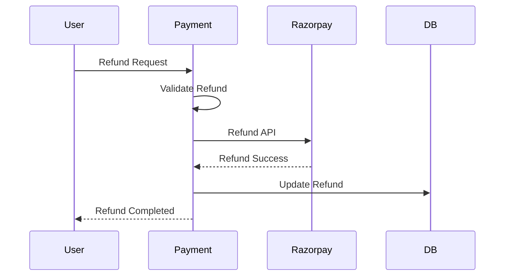

Each refund operation is recorded separately to preserve complete transaction traceability.

---

# 🧾 Receipt Generation Workflow

Receipts are generated only after successful payment confirmation.

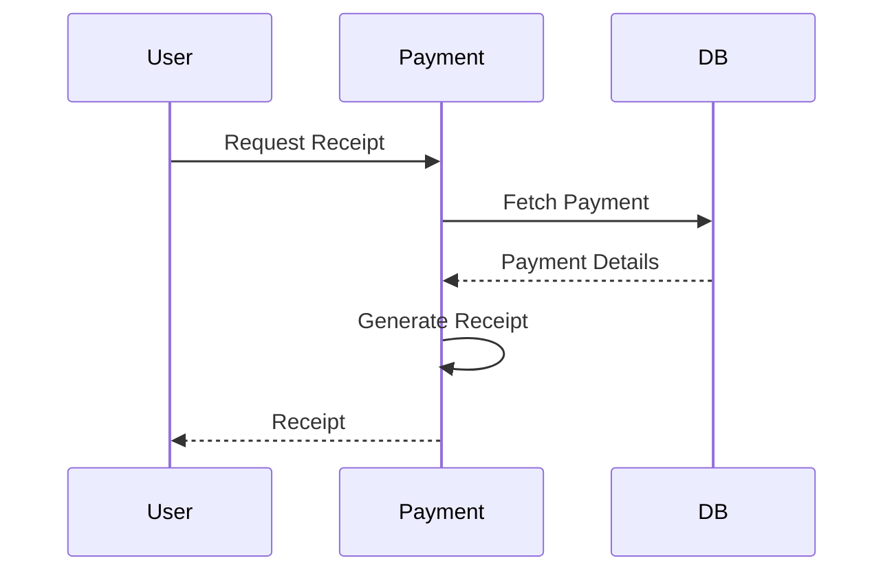

Receipt generation provides users with an official record of completed financial transactions.

---

# 🔄 Retry Payment Workflow

If a payment fails due to temporary issues, users can retry payment without recreating the booking.

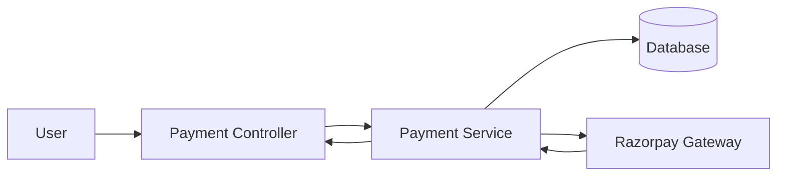

This improves user experience while avoiding duplicate bookings.

---

# 📩 Booking Service Coordination Workflow

The Payment Service coordinates payment status with the Booking Service throughout the booking lifecycle.

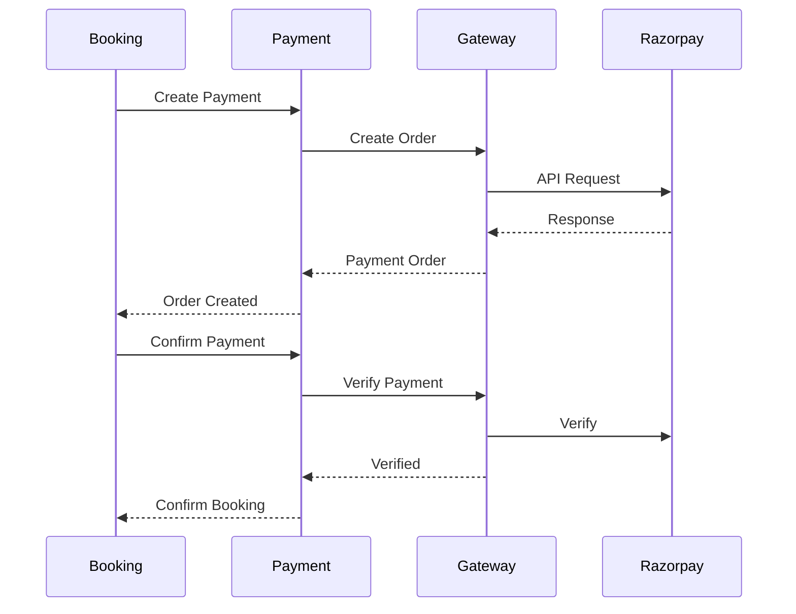

The Booking Service remains the owner of reservation data, while the Payment Service exclusively owns financial transactions.

---

# 🌐 External Payment Gateway Communication

The Payment Service integrates with Razorpay to securely process payment operations.

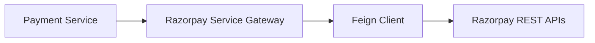

Using the official Razorpay SDK simplifies secure communication while reducing custom integration complexity.

---

# 🏢 Why Separate Payment Management?

Financial transactions require stronger consistency, traceability, and security than most business operations.

A dedicated Payment Service provides several enterprise advantages:

- Centralized ownership of all payment operations.
- Independent financial transaction lifecycle.
- Secure integration with external payment gateways.
- Reliable refund management.
- Complete payment audit history.
- Loose coupling between booking and payment domains.
- Independent scaling of payment workloads.
- Easier compliance with financial and auditing requirements.
- Improved maintainability through clear service boundaries.

By isolating payment processing into its own microservice, StayEase follows Domain-Driven Design principles while maintaining a scalable, secure, and production-ready financial architecture.

# 🏛 Enterprise Architecture Decisions

The StayEase Payment Service has been designed using enterprise software engineering principles to provide secure, scalable, maintainable, and reliable payment processing within a distributed microservices architecture.

Rather than acting as a simple CRUD application, the service owns the complete financial transaction domain while collaborating with other services through well-defined APIs and external payment gateway integration.

---

# 💳 Payment Processing Strategy

The Payment Service follows a centralized payment processing strategy where every financial transaction is managed within a dedicated microservice.

Instead of allowing multiple services to process payments independently, all payment operations are routed through the Payment Service.

This strategy provides several advantages:

- Centralized financial ownership
- Consistent payment lifecycle management
- Easier payment auditing
- Reduced business logic duplication
- Simplified gateway integration
- Improved maintainability

Centralizing payment processing ensures every transaction follows the same validation, verification, and persistence workflow.

---

# 🏦 Razorpay Integration Strategy

Rather than implementing payment processing from scratch, StayEase integrates with Razorpay as the external payment gateway.

The Payment Service uses the official Razorpay Java SDK to:

- Create payment orders
- Verify payment signatures
- Retrieve payment details
- Process refunds
- Synchronize payment information

Delegating payment gateway responsibilities to Razorpay allows the application to leverage a secure and industry-proven payment infrastructure while keeping business logic focused on booking and transaction coordination.

---

# 🔐 Payment Verification Strategy

Receiving a payment confirmation request alone is not sufficient to mark a transaction as successful.

Every payment undergoes a verification process before the payment status is updated.

The verification process includes:

- Payment existence validation
- Payment status validation
- Razorpay signature verification
- Transaction detail verification
- Business rule validation

Only verified payments are considered successful.

This prevents fraudulent or forged payment confirmations from affecting booking data.

---

# 🔄 Payment Lifecycle Strategy

Payments transition through a controlled lifecycle rather than allowing unrestricted status changes.

Typical payment states include:

- Pending
- Completed
- Failed
- Refunded

Each transition is validated against business rules before persistence.

Managing payments as a state machine improves consistency and prevents invalid financial operations.

---

# 💰 Refund Management Strategy

Refund processing is isolated from payment creation.

Each refund is treated as an independent financial transaction while maintaining a relationship with the original payment.

This strategy provides:

- Complete refund history
- Independent refund tracking
- Financial traceability
- Easier reconciliation
- Better reporting capabilities

Separating refunds from payments simplifies future enhancements such as partial refunds or multiple refund attempts.

---

# 🧾 Receipt Generation Strategy

Receipts are generated only after successful payment confirmation.

Generating receipts after verification ensures that only valid financial transactions produce official payment records.

Receipt generation provides:

- Proof of payment
- Financial documentation
- Customer transparency
- Future reporting support

This separation also allows receipt formats to evolve independently of payment processing.

---

# 📋 Audit Logging Strategy

Financial operations require complete traceability.

The Payment Service records important business events in dedicated audit logs.

Typical events include:

- Payment creation
- Payment confirmation
- Refund processing
- Payment failures
- Retry attempts

Maintaining audit logs provides:

- Operational visibility
- Easier debugging
- Financial auditing
- Historical tracking
- Compliance readiness

Audit logging ensures that every important financial action can be traced throughout the payment lifecycle.

---

# 🌐 Service Communication Strategy

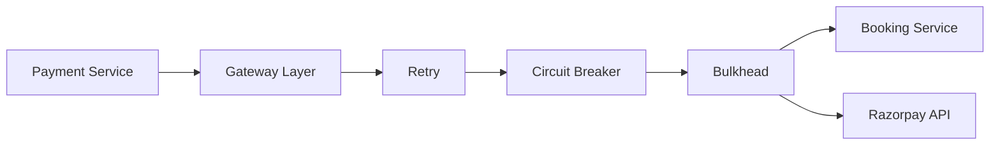

This loose coupling enables each service to evolve independently while collaborating through well-defined APIs.

---
# 🚪 Service Gateway Pattern

The Payment Service follows a dedicated **Gateway Pattern** for all outbound communication.

Instead of invoking Feign clients directly from business services, all external interactions are centralized inside Gateway classes.

Current gateways include:

- BookingServiceGateway
- RazorpayServiceGateway

Each gateway provides:

- Retry
- Circuit Breaker
- Bulkhead
- Fallback handling
- Centralized logging
- Cleaner business services
- Easier testing

---

# 🔄 Fault Tolerance Strategy

Distributed systems must handle temporary failures gracefully.

The Payment Service utilizes Resilience4j to improve communication reliability.

Fault tolerance mechanisms include:

- Retry
- Circuit Breaker

Benefits include:

- Temporary network recovery
- Reduced cascading failures
- Improved service availability
- Better user experience

These mechanisms increase overall resilience without complicating business logic.

---
# 📡 Service Discovery Strategy

The Payment Service uses **Netflix Eureka** for dynamic service discovery instead of hardcoded service URLs.

All internal microservice communication is resolved through Eureka, allowing services to register, discover, and communicate dynamically.

Benefits include:

- Dynamic service registration
- Automatic service discovery
- Improved scalability
- Environment-independent deployment
- Reduced configuration overhead
- Better cloud-native readiness
---

# 🛡 Security Strategy

Financial APIs require stronger security controls than typical business APIs.

The Payment Service secures endpoints using Spring Security together with Header Authentication.

Security responsibilities include:

- Authentication
- Authorization
- Internal service validation
- Protected payment operations

Only authenticated users and trusted internal services can perform payment-related operations.

---

# 🗄 Database Design Strategy

The Payment Service follows the **Database per Service** pattern.

Only payment-related information is stored within the Payment Service database.

Examples include:

- Payment orders
- Refund transactions
- Audit logs

Booking information remains exclusively owned by the Booking Service.

This approach reduces coupling while maintaining clear domain ownership.

---

# 📦 DTO Strategy

DTOs separate API contracts from persistence models.

Benefits include:

- Entity encapsulation
- Stable APIs
- Independent model evolution
- Better validation
- Reduced coupling

Clients never interact directly with JPA entities.

---

# 🔁 Transaction Management Strategy

Payment operations frequently update multiple records.

Transactional boundaries ensure these operations execute atomically.

Typical transactional operations include:

- Payment confirmation
- Refund creation
- Audit log persistence

If any operation fails, the transaction is rolled back, preserving financial consistency.

---

# ✅ Validation Strategy

Validation occurs across multiple layers.

The Payment Service validates:

- Incoming request payloads
- Business rules
- Payment states
- Refund eligibility
- Booking consistency

Early validation reduces unnecessary processing and improves API reliability.

---

# ⚠ Exception Handling Strategy

The application centralizes error handling using a Global Exception Handler.

Business exceptions include:

- ResourceNotFoundException
- BusinessException

Centralized exception handling provides:

- Consistent API responses
- Cleaner controllers
- Easier maintenance
- Better client experience

---

# ⚙ Externalized Configuration Strategy

Application configuration is externalized through Spring Boot configuration files.

Examples include:

- Database configuration
- Razorpay credentials
- OpenFeign settings
- Logging configuration
- Environment profiles

Externalizing configuration improves portability and simplifies deployment across multiple environments.

---

# 📝 Logging Strategy

The Payment Service uses structured logging throughout important business operations.

Logged events include:

- Payment creation
- Payment confirmation
- Refund processing
- External gateway communication
- Business validation failures

Structured logging significantly improves production monitoring and troubleshooting.

---

# 🚀 Production Readiness

The Payment Service has been designed with production-oriented architecture principles.

Key production capabilities include:

- Secure payment processing
- External payment gateway integration
- Transaction management
- Global exception handling
- Audit logging
- Layered architecture
- OpenFeign communication
- Bean Validation
- Structured logging
- Resilience4j
- Database per Service
- Externalized configuration

These practices improve scalability, maintainability, and operational reliability.

---
# 📈 Monitoring & Observability

The Payment Service exposes production-ready monitoring capabilities using Spring Boot Actuator and Micrometer.

Monitoring includes:

- Health Checks
- Metrics
- JVM Statistics
- Memory Usage
- Thread Statistics
- HTTP Metrics
- Application Info
- Prometheus Metrics

These endpoints simplify integration with Prometheus and Grafana for production monitoring.

---
# 🔮 Future Enhancements

The architecture has been designed to support future enhancements with minimal changes.

Potential improvements include:

- Razorpay Checkout UI integration
- Webhook-driven payment confirmation
- Kafka event publishing
- Distributed transactions using Saga Pattern
- Redis caching
- Payment analytics
- Multiple payment gateway support
- Scheduled reconciliation jobs
- Observability with Prometheus and Grafana
- Docker deployment
- Kubernetes orchestration
- CI/CD pipelines

The current architecture allows these capabilities to be introduced without significant refactoring.

---

# 🏗 Enterprise Design Principles

The Payment Service follows several enterprise software engineering principles.

- Single Responsibility Principle
- Separation of Concerns
- High Cohesion
- Loose Coupling
- Layered Architecture
- Domain-Driven Design
- Database per Service
- API-First Design
- Transactional Consistency
- Externalized Configuration

These principles improve long-term maintainability and support enterprise-scale growth.

---

# 📖 Enterprise Design Summary

The StayEase Payment Service demonstrates a production-oriented payment architecture by combining secure payment processing, external gateway integration, centralized financial ownership, audit logging, refund management, transaction consistency, and resilient inter-service communication.

Rather than embedding payment logic inside booking workflows, the application delegates all financial responsibilities to a dedicated Payment Service. This separation enables independent scalability, stronger security, easier maintenance, and cleaner domain boundaries while following modern microservices architecture principles.

# 🚀 Getting Started

Follow the steps below to set up and run the StayEase Payment Service locally.

---

# 📋 Prerequisites

Ensure the following software is installed before running the project.

| Software | Version |
|----------|---------|
| Java | 21 or later |
| Gradle | 8.x or later |
| MySQL | 8.x |
| Git | Latest |
| IDE | IntelliJ IDEA / Eclipse / VS Code |

You will also need:

- Running MySQL instance
- Razorpay Test Account
- Booking Service running for inter-service communication

---

# 📥 Clone Repository

```bash
git clone https://github.com/PSaiRam32/stayease-payment-service.git

cd stayease-payment-service
```

---

# ⚙ Configure Application

Update the `application.yaml` file with your local configuration.

Typical configurations include:

- Database URL
- Database Username
- Database Password
- Razorpay Key ID
- Razorpay Secret
- Booking Service URL
- Server Port

Never commit production secrets to the repository.

---

# 🗄 Database Setup

Create a MySQL database for the Payment Service.

Example:

```sql
CREATE DATABASE stayease_payment_service;
```

Spring Boot will automatically create the required tables using Hibernate.

---

# ▶ Running the Application

Using Gradle:

```bash
./gradlew bootRun
```

Or build the project:

```bash
./gradlew clean build
```

The service will start on the configured server port.

---

# 🌐 REST API Overview

The Payment Service exposes REST APIs for payment management.

Major API groups include:

## Payment APIs

- Create Payment Order
- Confirm Payment
- Verify Payment
- Retry Failed Payment
- Get Payment Details
- Get Payment History

## Refund APIs

- Process Refund
- Get Refund Details

## Receipt APIs

- Generate Receipt
- Get Receipt

## Development APIs

- Test Payment Confirmation

---

# 🧪 Testing

Testing can be performed using:

- Postman
- IntelliJ HTTP Client
- Swagger (if enabled)

Recommended test scenarios:

- Payment Order Creation
- Payment Confirmation
- Failed Payment
- Retry Payment
- Refund Processing
- Payment History Retrieval
- Receipt Generation
- Invalid Payment Requests

---

# 📊 Monitoring

Production deployments should monitor:

- Payment Success Rate
- Failed Payments
- Refund Volume
- API Response Time
- External Gateway Latency
- Error Rate
- Database Performance

These metrics help identify operational issues early.

---

# ⚡ Performance

The Payment Service is designed with performance and reliability in mind.

Performance considerations include:

- Spring Data JPA
- Efficient database access
- OpenFeign communication
- Structured logging
- Transaction management
- Resilience4j fault tolerance

---

# 🔒 Security Best Practices

The Payment Service protects sensitive financial operations using multiple security mechanisms.

Best practices include:

- Secure Razorpay credentials
- Header-based authentication
- Spring Security
- Input validation
- Payment verification
- Secure API communication

Secrets should always be managed using environment variables or external configuration services.

---

# 🤝 Contributing

Contributions are welcome.

Recommended workflow:

1. Fork the repository.
2. Create a feature branch.
3. Commit changes with meaningful messages.
4. Push the branch.
5. Open a Pull Request.

Please ensure:

- Coding standards are followed.
- Unit tests pass.
- Documentation is updated when required.

---

# 📄 License

This project is licensed under the MIT License.

Refer to the LICENSE file for details.

---

# 👨‍💻 Author

**Sai Ram Paidipati**

Java Backend Developer

GitHub:
https://github.com/PSaiRam32

LinkedIn:
https://www.linkedin.com/in/sairam-paidipati/

---

# 💬 Support

If you encounter issues or have suggestions:

- Open a GitHub Issue.
- Submit a Pull Request.
- Contact the author through GitHub or LinkedIn.

Constructive feedback and contributions are always appreciated.

---

# 📚 Learning Outcomes

This project demonstrates practical implementation of enterprise backend concepts including:

- Payment Processing
- External Payment Gateway Integration
- Razorpay SDK
- Payment Verification
- Refund Management
- Audit Logging
- Receipt Generation
- Spring Security
- Spring Data JPA
- OpenFeign
- Bean Validation
- Global Exception Handling
- Resilience4j
- Layered Architecture
- Domain-Driven Design
- Database per Service
- Transaction Management
- Structured Logging

---

# 📖 References

Official documentation and resources:

- Spring Boot Documentation
- Spring Security Documentation
- Spring Data JPA Documentation
- OpenFeign Documentation
- Resilience4j Documentation
- Razorpay Developer Documentation
- MySQL Documentation
- Gradle Documentation

---

# 📝 Project Summary

The StayEase Payment Service serves as the financial transaction domain of the StayEase platform.

It centralizes payment order creation, payment verification, refund management, receipt generation, audit logging, and secure communication with Razorpay while coordinating payment status with the Booking Service.

By following modern microservices principles such as Database per Service, Layered Architecture, OpenFeign communication, transaction management, and secure gateway integration, the Payment Service provides a scalable, maintainable, and production-oriented foundation for handling financial operations.

---

# 🙏 Acknowledgements

This project was developed to demonstrate enterprise-grade payment processing within a distributed microservices architecture.

It incorporates modern backend engineering practices including:

- Secure Payment Processing
- Razorpay Integration
- Payment Verification
- Refund Processing
- Receipt Generation
- Audit Logging
- Transaction Management
- OpenFeign Communication
- Spring Security
- Bean Validation
- Layered Architecture
- Domain-Driven Design
- Database per Service
- Resilience4j Fault Tolerance

Thank you for exploring the StayEase Payment Service repository. Your feedback and contributions are greatly appreciated.
